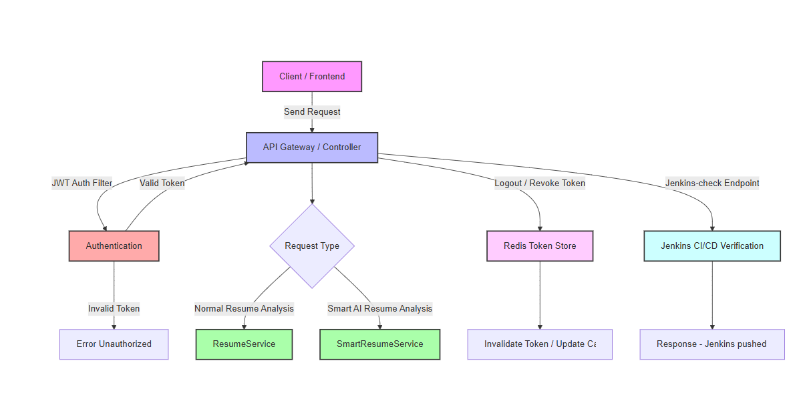

# Resume Ranker / Smart Resume Analyzer

## Project Overview

**Resume Ranker** is a **Java Spring Boot application** that analyzes and ranks resumes against job descriptions.  
It offers both **Normal Resume Analysis** and **Smart AI-Powered Resume Analysis**.  

Key features:  
- Match score computation using **cosine similarity**  
- Keyword extraction from resumes and job descriptions  
- Missing skill identification  
- AI-powered feedback and strengths summary  
- JWT-based authentication with **Redis token revocation**  
- CI/CD integration with **Jenkins** and Docker  

---

## Table of Contents

1. [Technologies Used](#technologies-used)  
2. [Project Structure](#project-structure)   
3. [Getting Started](#getting-started)  
4. [Important APIs](#important-apis)  
5. [Postman Links](#postman-links)  
6. [License](#license)  

---

## Technologies Used

| Layer | Technology / Library | Purpose |
|-------|-------------------|---------|
| Backend | Spring Boot | REST API framework |
| Security | Spring Security, JWT | Authentication & Authorization |
| Caching | Redis | JWT token revocation and session management |
| NLP | Stanford CoreNLP, Apache Tika | Resume text extraction, tokenization |
| Similarity | Cosine Similarity | Resume vs Job scoring |
| AI / ML | Custom AI prompts / Smart Analysis | Resume evaluation and feedback generation |
| Build & CI/CD | Maven, Jenkins, Docker | Build automation, containerization, CI/CD |
| Database | H2 | User & resume data storage |
| Frontend | React | Resume upload interface and results |

---

## Project Structure
Below is the project structure and flow of **ResumeRanker**:

---

## Important API

| Endpoint                     | Method | Description                       | Request Body / Headers                                               | Response                                            |
| ---------------------------- | ------ | --------------------------------- | -------------------------------------------------------------------- | --------------------------------------------------- |
| `/auth/register`             | POST   | Register a new user               | JSON `{ "username": "user", "password": "pass" }`                    | 200 OK, User registered                             |
| `/auth/login`                | POST   | User login, returns JWT token     | JSON `{ "username": "user", "password": "pass" }`                    | 200 OK, JWT token                                   |
| `/auth/logout`               | POST   | Logout user, invalidate JWT token | Bearer JWT in `Authorization` header                                 | 200 OK, Logged out                                  |
| `/auth/role/create`          | POST   | Create a new role (Admin only)    | JSON `{ "roleName": "ROLE_USER" }` + Bearer JWT                      | 200 OK, Role created                                |
| `/auth/admin/revoke-token`   | POST   | Revoke JWT token using Redis      | JSON `{ "token": "<jwt>" }` + Admin Bearer JWT                       | 200 OK, Token revoked                               |
| `/user/create`               | POST   | Create a new user (Admin only)    | JSON `{ "username": "user", "password": "pass" }` + Admin Bearer JWT | 200 OK, User created                                |
| `/api/resumes/analyze`       | POST   | Normal resume analysis            | JSON `{ "resume": "...", "jobDescription": "..." }` + Bearer JWT     | 200 OK, Match score, keywords, missing skills       |
| `/smart/api/resumes/analyze` | POST   | Smart AI-powered resume analysis  | JSON `{ "resume": "...", "jobDescription": "..." }` + Bearer JWT     | 200 OK, Match score, AI feedback, strengths summary |
| `/jenkins/check`             | GET    | CI/CD test endpoint               | Bearer JWT                                                           | 200 OK, "Jenkins pushed this fine and CI/CD worked" |

### Postman Links for Full API Documentation

* Analyse APIs (Resume Analysis): Postman Link

* Auth & User Management APIs: Postman Link
